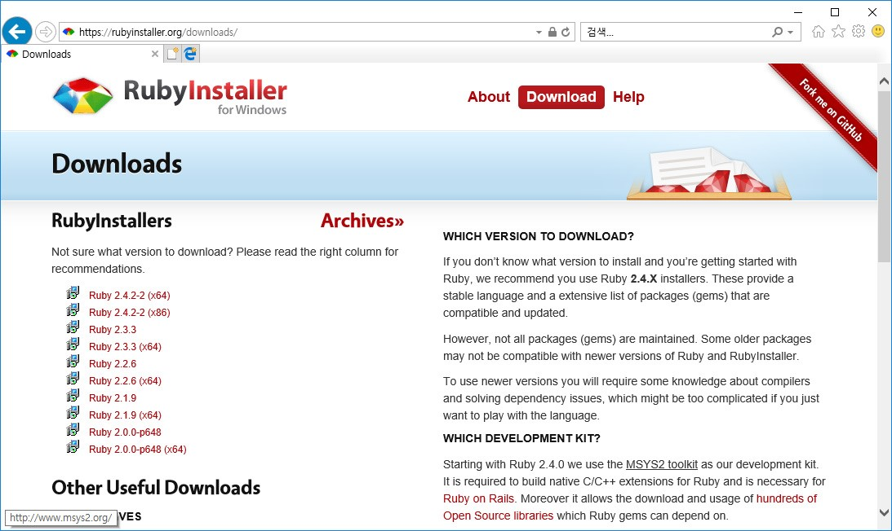

26. 지킬(JekyII)
깃허브의 깃페이지는 내부적으로 지킬(Jekyll)을 기반으로 합니다. 템플릿 및 디자인등의 다양한 작업을 위해서는 지킬의 사용법을 알아 두는 것이 필요합니다.

26.1 정적페이지 생성기
지킬은 정적 페이지 생성기 입니다. 지킬을 사용하기 위해서는 루비의 설치와 지킬 패키지를 다운로드 받아야 합니다.

26.1.1 설치 준비
JekyII 은 루비라는 언어로 제작이 된 소프트웨어 입니다. 따라서 JekyII 를 사용하기위해서는 먼저 자신의 컴퓨터에 루비를 설치하여야 합니다.

제킬의 공식 사이트는 다음과 같습니다:
http://jekyllrb.com
