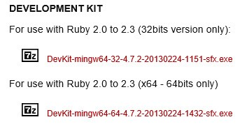

# 루비 설치
윈도우 환경에서 루비를 설치해 보도록 하겠습니다. 루비 설치파일은 루비 공식사이트에서 다운로드 받을 수 있습니다. http://rubyinstaller.org/downloads/

운영체제 버전에 맞게 다운로드합니다.

## 설치

## 개발킷
루비의 설치가 성공적으로 잘 마무리가 되었다면 추가적으로 개발킷(Development Kit)도 같이 설치합니다. 

 

개발킷은 루비 공식사이트에서 같이 다운로드 받을 수 있습니다.